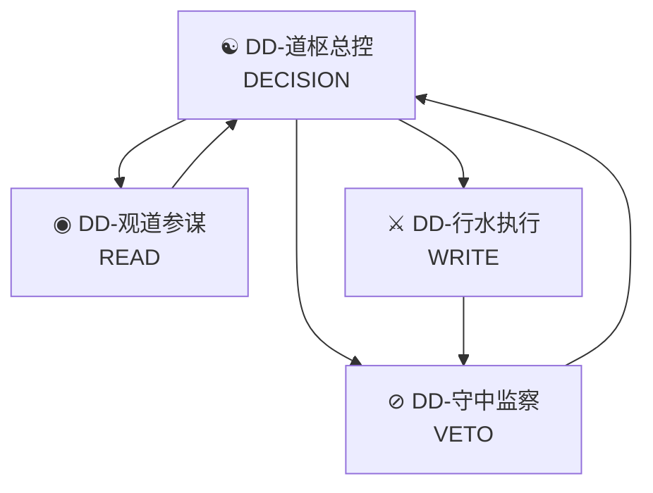
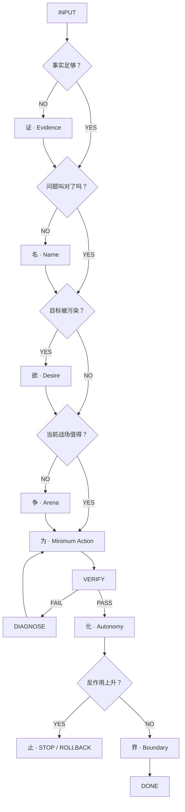

<div align="center">

# ☯ DD-DaoKernel

### 道核 · A Decision Kernel for Codex

**不是让 Agent 做得更多。**  
**是在它有能力胡来的时候，仍然知道什么不该做。**

[](#)
[](#)
[](#八字内核)
[](#四种权力)
[](LICENSE)

**中文** · [English](#english)

<br/>

### `证 → 名 → 欲 → 争 → 为 → 化 → 止 → 界`

</div>

---

## 为什么有 DD-DaoKernel

Coding Agent 真正危险的地方，不是它不会写代码。

而是它越来越会写以后：

> **需求没搞清，也能写。**  
> **事实没验证，也能推理。**  
> **一个局部 Bug，也能顺手重构半个项目。**  
> **事情已经解决了，它还能继续优化。**  
> **权限给得够大，它甚至可以非常高效地做错一件事。**

所以我做了 DD-DaoKernel。

它不负责让 Agent 获得更多能力。

它负责另一件事：

<div align="center">

## **约束能力**

</div>

---

## 一句话

```text
能做 ≠ 该做
```

DD-DaoKernel 是一套为 Codex / Coding Agent 设计的决策内核。

我把《道德经》中真正能落到现实决策、复杂系统和软件工程的部分，重新编码成：

```text
证 → 名 → 欲 → 争 → 为 → 化 → 止 → 界
```

不是让机器学习老子说话。

而是把：

> **不过度**

变成机器可以执行的规则。

---

# 八字内核

| 核心 | Skill | 一句话 | 作用 |
|---|---|---|---|
| 🔵 **证** | `dd-evidence` | 未证，不断 | 把事实、假设、未知拆开 |
| 🟣 **名** | `dd-name` | 名非其实 | 防止把方案误当目标 |
| 🌸 **欲** | `dd-desire` | 去噪见真 | 去掉焦虑、面子、控制欲 |
| 🟠 **争** | `dd-arena` | 不争其局 | 不在烂战场里硬优化 |
| 🟢 **为** | `dd-min-action` | 少动一刀 | 找到最小充分行动 |
| 🩵 **化** | `dd-autonomy` | 成而自化 | 降低持续人工依赖 |
| 🔴 **止** | `dd-stop` | 过则反 | 成功后也检查反作用 |
| 🛡️ **界** | `dd-boundary` | 能为非权 | 管权限、可逆性和影响面 |

---

## 🔵 证 · Evidence

> **未证，不断。**

模型最危险的能力之一，是能把不知道的东西补成一个非常合理的故事。

所以先拆：

```text
VERIFIED
ASSUMPTION
UNKNOWN
OPINION
```

只验证那些真正会改变决策的未知。

不是为了知道更多。

是为了少错。

<details>
<summary><b>展开：为什么“证”必须放在道家内核前面</b></summary>

古代哲学可以假设“圣人知之”。

现代 Agent 不行。

模型天然会补全、推断、合理化。

所以我主动给这套内核加了一道现代护栏：

> **不知道，就标不知道。**

</details>

---

## 🟣 名 · Name

> **方案不是目标。指标不是现实。名字也不一定就是问题。**

```text
“数据库太慢”
```

可能只是一次错误查询。

```text
“需要重构”
```

可能只是一个边界条件没处理。

```text
“用户需要 AI”
```

可能只是用户不想填表。

一旦问题被错误命名，人和机器都会开始非常认真地优化错误答案。

所以：

<div align="center">

### **先正名，再动手。**

</div>

---

## 🌸 欲 · Desire

> **欲不去，智为欲役。**

目标里经常混着：

```text
焦虑
面子
证明自己
控制欲
报复
攀比
沉没成本
```

DD-DaoKernel 不消灭野心。

它只问：

> **把这些东西拿掉以后，我真正还需要什么？**

---

## 🟠 争 · Arena

> **不争，不是不赢。**

真正的不争，不是认输。

是：

<div align="center">

### **拒绝接受别人替我定义的胜负函数。**

</div>

如果当前路径本身就是错的：

不要优化它。

```text
换入口
换指标
换时间
换路径
换战场
```

有时候最强的优化不是：

```text
+20%
```

而是：

```text
DELETE PATH
```

---

## 🟢 为 · Action

> **无为，不是什么都不做。**

它真正对应：

```text
minimum sufficient intervention
```

不是问：

```text
还能做什么？
```

而是不断问：

```text
还能删掉哪一步？
```

直到：

```text
再删一步
→ 目标无法成立
```

剩下的，就是该做的。

---

## 🩵 化 · Autonomy

> **做完，不等于完成。**

真正完成是：

> **离开执行者以后，事情仍然能够运行。**

继续检查：

```text
谁发现异常？
谁负责恢复？
有没有反馈？
有没有单点依赖？
什么时候必须交还给人？
自动化失效以后怎么办？
```

目标：

```text
actor_dependency ↓
```

真正好的自动化：

> **必须同时设计退出自动化的方法。**

---

## 🔴 止 · Stop

> **知止，可以不殆。**

失败会制造风险。

成功也会。

任何优势走到极端，都可能开始制造自己的反作用：

```text
自动化太强 → 黑箱
权限太大 → blast radius
抽象太多 → 理解成本
Agent 太主动 → 越权
功能太多 → 维护成本
优化太久 → 把已经成功的东西做坏
```

持续判断：

```text
marginal_gain <= reverse_risk
```

成立：

```text
STOP
```

> **没有停止条件的 Agent，本质上是在无限优化一个有限问题。**

---

## 🛡️ 界 · Boundary

> **能做，不等于有权做。**

涉及：

```text
删除
覆盖
发布
付款
权限修改
外部通信
生产环境
数据迁移
用户资产
不可逆操作
```

重新检查：

```text
权限
可逆性
影响半径
外部副作用
回滚路径
```

这是我主动加给古代思想的一层现代护栏。

> **大道可以讲无为。工程不能没有责任边界。**

---

# 开天眼

不是预测未来。

不是算命。

所谓“开天眼”，只是：

> **主动看见正常工作流最容易漏掉的东西。**

<details>
<summary><b>◉ 天眼 · Blind-Spot Scan</b></summary>

```text
盲点
证伪证据
隐藏变量
异常信号
```

核心问题：

```text
What am I not seeing?
```

</details>

<details>
<summary><b>奇门 · Change the Arena</b></summary>

不优化烂路线。

直接检查：

```text
换入口
换目标函数
换时间
换战场
```

</details>

<details>
<summary><b>遁甲 · Preserve the Irreversible</b></summary>

真正的“遁甲”不是隐藏自己。

而是先保护：

```text
原始数据
生产环境
权限
密钥
用户资产
回滚能力
退出路线
```

先保甲，再出兵。

</details>

<details>
<summary><b>反局 · Premortem</b></summary>

先假设：

```text
三个月以后
这个方案已经失败
```

再倒着问：

```text
它最可能死在哪里？
哪个优点后来变成了缺点？
哪一步其实早就该停？
```

</details>

<details>
<summary><b>借势 · Borrowed Momentum</b></summary>

优先寻找：

```text
已有代码
已有基础设施
已有用户行为
已有趋势
```

能借，不造。

</details>

<details>
<summary><b>空城 · Preserve Optionality</b></summary>

主动留下：

```text
空上下文
备用权限
未占资源
人工出口
回滚空间
```

“无”不是没有。

而是：

> **没有被占满的可能性。**

</details>

<details>
<summary><b>知止 · Circuit Breaker</b></summary>

```text
PASS → STOP
RISK ↑ → ROLLBACK
UNKNOWN HIGH → HUMAN
```

</details>

---

# 四种权力

我没有设计十二种人格。

最后只留下四个 Agent。

因为真正需要分开的不是人格。

而是：

<div align="center">

## **权力**

</div>



---

## ☯ DD-道枢总控

**决策权。**

负责：

```text
判断本质
选择 Skill
收敛任务
决定下一步
```

单任务最多调用：

```text
3 Skills
```

最大的优点：

> **敢删任务。**

最大的缺点：

> 也正是敢删任务。

它可能过早收敛。

所以它不能垄断观察。

---

## ◉ DD-观道参谋

**观察权。**

只读。

负责：

```text
事实
盲点
隐藏假设
反事实
利益关系
二阶后果
```

它最大的缺点：

```text
不能写
```

也是最大的优点：

> **看错了，不至于直接把东西改坏。**

---

## ⚔ DD-行水执行

**执行权。**

原则：

```text
smallest patch
reversible
verifiable
no side quest
```

没有：

```text
“顺便”
```

它可能留下技术债。

但已知技术债，通常比一次“顺手重构”制造的未知债便宜。

---

## ⊘ DD-守中监察

**否决权。**

当所有人都说：

```text
“能做。”
```

它还要问：

```text
“该做吗？”
```

输出：

```text
GO
GO WITH CONDITIONS
STOP
HUMAN
```

它会让高风险任务变慢。

这就是它存在的理由。

---

# 运行逻辑



---

# 一个最简单的例子

### 问题

```text
支付回调偶尔重复入账。
```

普通 Agent 可能看到：

```text
支付模块很乱
```

然后一路：

```text
重构 payment service
→ 重构 repository
→ 升级依赖
→ 补类型
→ 改日志
→ 加缓存
```

DD-DaoKernel：

```text
证
↓
确认重复入账真实触发链

名
↓
问题 = 幂等缺失
而不是“支付模块很丑”

为
↓
增加幂等键
增加回归测试

VERIFY
↓
重复回调只入账一次

止
↓
STOP
```

当前不做：

```text
重构 repository
```

任务结束。

---

# 什么时候不要用它

这些事情：

```text
改一个颜色
改一句文案
明确的一行 Bug
格式化文件
```

直接做。

如果每个小任务都：

```text
证 → 名 → 欲 → 争 → 为 → 化 → 止 → 界
```

那不是大道。

那是官僚主义。

---

# English

> **I do not want Codex to merely look smarter.**
>
> **I want it to remain capable of not acting, even when it has the power to act.**

DD-DaoKernel is a decision kernel for coding agents.

It does not primarily add capability.

It constrains capability.

### Kernel

```text
Evidence → Name → Desire → Arena
→ Action → Autonomy → Stop → Boundary
```

| Kernel | Meaning |
|---|---|
| **Evidence** | Unverified claims are not facts |
| **Name** | A proposed solution is not the goal |
| **Desire** | Remove ego and control-noise |
| **Arena** | Do not optimize a bad fight |
| **Action** | Use the minimum sufficient intervention |
| **Autonomy** | Reduce actor dependency |
| **Stop** | Stop when reverse risk overtakes marginal gain |
| **Boundary** | Capability is not authority |

### Four Agents

```text
DD-道枢总控 → DECISION
DD-观道参谋 → READ
DD-行水执行 → WRITE
DD-守中监察 → VETO
```

### Final Principle

DD-DaoKernel is not primarily a capability amplifier.

It is a:

> **capability stabilizer**

The goal is not to make an agent do less.

It is to prevent the extra move that creates more problems than it solves.

---

<div align="center">

## 大道至简

**不是把事情想简单。**

**是看过复杂以后，仍然只动那一下。**

</div>
